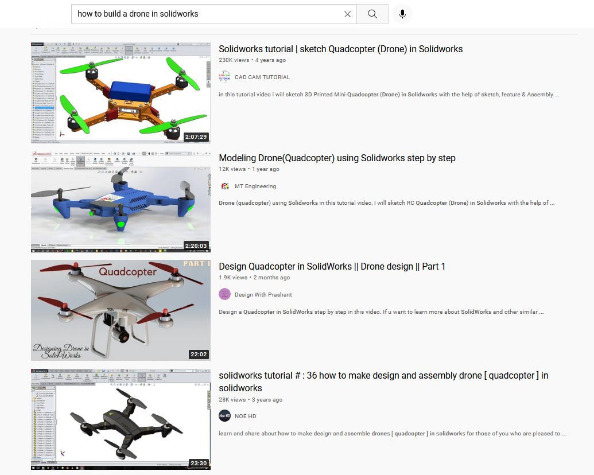

# Pain and PIDs: Our Journey in Drone Design

## Introduction

Strange title isn't it? It manages to sum up our experience with this project quite well though. For the Eklavya Mentorship program, my teammate and I undertook the task of building a drone from scratch and designing it's control system.

Quite an intimidating task for the both of us, given that we were complete beginners in almost all areas of robotics. Thankfully we had the guidance of some great mentors and an amazing community thanks to our college club: [SRA](https://sravjti.in/).

> Q: So how does one go about building a drone?
> A: You design it first

## **Trial 1** : Solidworks and URDFs

We started out at the same place everyone does when they need to do something but don't know how to: **YouTube**



Incidentally we went for the **fourth video** in this list, mainly because it looked cool

Then came the fun but arduous task of actually making the Drone in SolidWorks. It involved three steps:

1. Making each indicidual part and saving it as a SolidWorks part file(.sldprt).
2. Adding all the parts in an Assembly file and liniking them together using different joints(but mostly prismatic) to create the Drone assembly file.
3. Then came the most crucial part, making the drone look sleek & sexy(actually not that important).

> Tip : Pick a nice 2 hr long album, couple of cups of Mocha and designing in SolidWorks turns into a meditative act.

After a lot of hours in Solidworks, our finished model was ready.

Now, to actually be able to simulate this model and controlled by ROS we needed to convert our SolidWorks assembly into a URDF (Universal Robot Description Format). Fortunately, some kind hearted soul had thought of adding an extension in SolidWorks where by we could natively export our assembly into an URDF (God Bless the resourcefullness of programmers!).

## **Trial 2** : Understanding ROS & Gazebo

This step involves us trying to build our Drone a playground to experiment in. It uses two softwares which are going to be critical going forward :

### 1. ROS (Robot Operating System)

ROS is an open-source, meta-operating system for your robot. Basically ROS enables us to control our Drone(and its specific parts) using Python/C++ code. ROS communication implements data transmission between **Nodes** using **Topics**.

#### ROS Node

All processes in ROS run in a Node. For eg: In our Drone each Wing Link(the joint between the wing and the base),the camera, IMU sensors are all nodes. The Python script we write itself creates many nodes.

#### ROS Topics

Topics are the _named_ channels over which the nodes exchange messages. Topics can be either:
**subscribed to** - For sending data through the topic.
**published to** - For recieving data from the topic.

So, suppose we want to change the speed of wing link 1 of our Drone from 10 to 100 using a Python script then in ROS terms that would look as follows:

(placeholder)
Python Script creates Node---(pubs to pwm topic)----------------------------------(subs to pwm topic)----> Wing Link Node

<!-- Insert img here -->

### 2. Gazebo

Gazebo is ROSs' native simulation software which enitrely is a Node in itself! (props to ROS devs for sticking to their guns with their comms sytem). It can open our URDF file in a simulated world.
<Insert img of first model in gazebo>

However this "lo and behold!" moment turned sour pretty quick when we saw that none of the textures in our mesh files got registered. After banging our heads for sometime we finally found a solution which involved using Blender(of all things) to "re-texturize" our model and then export the meshes as .stl files.

## Trial 3 : World Building

World building is a fancy way of saying making our drone do and respond to the numerous pyhsical phenomena in the simulated world as it would in the real world(Yes, that still exists). This means giving it propulsion so that upon the wings spinning enough thrust would be generated to make the drone rise in the sky like a pheonix!(can you tell how obssessed we were with our model). Also attaching various sensors like 1. GPS - For getting position and velocity. 2. IMU - For getting orientation. 3. Camera - For visualizing its surroundings.

We had planned to just use some pre-built propulsion and sensor plugins and add them to our URDF and move on to the next part but _Ohhh no no_; The ROS Gods had some other plans in mind. The plugins seemed damn near incompatible with our model. Anytime we would try to run the simulation the drone would just twitch and sway like a dog dry humping the ground(like it had an epilepsy fit.<replacement joke incase the first ones too offensive>). (I think this is too offensive :joy:)

<Insert video of guy having epilepsy fit alongside our drone vid :)>

Turns out the problem was with the wing joints not being registered as revolute. However, even though we got a somewhat what more stable system after fixing that, the drone would still not lift. There were many painful days spent scouring all sorts of forums drearily tring to sniff out even a whiff of a solution.
Finally we did what most programmers do when they can't find a solution to a problem....we just took someone else's model and abandoned ours. And trying to stick to our _high standards_ this someone else was none other than IIT Bombay(specifically the model they provided for their E-Yantra 2020 competition).

And Finally! after about two weeks(which felt like a month)of debugging we had a flying drone!

<Insert link of E-yrc Model>
    
<Insert vid of glorious E-Yantra drone flying>
    
And thus with our model and world set up we were ready to move onto building the control system.
    
    
## Trial 4: Control System
No matter how complex the control theory is, at the end of the day what we can control about the drone are simply the motor speeds i.e. how fast the fans at the end spin.
But to accomplish more complicated tasks with the drone (moving, stablilising etc.) we must make some layers that control these motors according to human inputs.
This is the flow of the drone control system. We'll go into the individual components going ahead but as an overview:
    (Image of block diagram about control system - The one Jash made)
    
The user gives input co-ordinates and a target altitude for the drone. Our goal was to get the drone to fly to the target co-ords autonomously. 
To accomplish this we needed to know a few things:
1. Where it was `(duh!)`   
2. What its velocity was
3. What its orientation was

#### Where are you Drone?

To get its position we had two options, since the drone was in a simulation, we could just ask gazebo to tell us where the model was. Otherwise, we could have the onboard GPS give us the latitude and longitude positions of the drone.

Both of these approaches were nearly identical. We went with getting the X-Y co-ordinates from Gazebo since it was much more intuitive to give it input co-ords than arbitrary lat - long values.

```
Insert code for get model state here
```

#### Slow Down Drone!

Another important aspect was its speed, if the drone went too fast it risked destabilising itself and flipping over. Hence we had to maintain a careful control over its speed.

We obtained the velocity values via an IMU ([Inertial Measurement Unit](https://en.wikipedia.org/wiki/Inertial_measurement_unit)) onboard the drone.

```
read_sensor_data code here
```

#### Don't Flip Out Drone!

The IMU also gets us the orientation of the drone or its Roll, Pitch and Yaw. Fancy terms to describe tilted it is with X, Y and Z axes

(Roll Pitch Yaw images) preferably in a line

```
code for the r, p, y
```

These values always need to be in a small acceptable range, otherwise the drone will not be able to fly properly. ("flying" being sort of an imp part <Maybe joke here?>)

> Q: Okay, but how does all this info really help us getting the drone to do what we want? Since at the end of the day, all we can really control are motor speeds.
> A: This is where the **motor mixing algorithm** comes in

#### Meet Thy Motors (The Four Commandments of Motors maybe?)

Using advanced mathematical methods of analysis, some _very smart_ people have come up with a way to control roll, pitch and yaw through just the motor speeds.

```
Motor mixing algorithm here
```

For our part, we took them at their word and stuck this as the final component of our control system.

_Et voilà!_ our drone could fly and move according to our commands!

Well.... not exactly. There's one component that comes in between that I've avoided talking about so far: **PIDs**.

## Trial 5: Pain with PIDs

PID stands for Proportional, Integral, Derivative. If the name sounds scary don't be afraid, PIDs are relatively simple to implement and get running.

All it is, is a way for the system (drone) to be able to bring itself towards a target value by correcting its error.

In this case, PIDs operate between Roll, Pitch, Yaw, Thrust values and the Motor Mixing Algorithm. They consider the taget values, look at the current values and then decide if the motor speeds should be higher or lower to get to the target values and how high and how low these values should be.

(PID diagram with the fancy E symbol)

The code is relatively simple

```
Pid code for one thing, thrust maybe?
```

Now you may have noticed the p_term, i_term and d_terms. What are they? They're values that are multiplied to the error. Doing so, they adjust the output and keep it _juust_ right so that the system (drone) remains stable.

The horror? These values are **random**.
Let me say that again, THESE VALUES ARE **RANDOM** !!!

Since each system is different, so are these values. While there are a few broad guidelines to tuning PIDs, they are, _by and large_ left in the hands of the users themselves.

> Q: How does one determine the _variables_ that determine the **fate** of your system?
> A: Trial and error :slightly_smiling_face:

Cue getting the drone to move autonomously
Cue countless hours of frustration
(Find an interesting way to edit the above lines?)

## Flying is Hard
