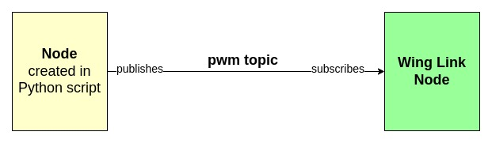

# Persistence and PIDs: Our Journey in Drone Design

Strange title isn't it? It manages to sum up our experience with this project quite well though. For the Eklavya Mentorship program, my teammate and I undertook the task of building a drone from scratch and designing it's control system.

Quite an intimidating task for the both of us, given that we were complete beginners in almost all areas of robotics. Thankfully we had the guidance of some great mentors and an amazing community thanks to our college club: [SRA](https://sravjti.in/).

> Q: So how does one go about building a drone?

> A: You design it first :pencil:

## Search, Design, Develop

We started out at the same place everyone does when they need to do something but don't know how to: **YouTube**


Incidentally we went for the **fourth video** in this list, mainly because it looked cool

Then came the fun but arduous task of actually making the Drone in SolidWorks. It involved three steps:

1. Making each individual part and saving it as a SolidWorks part file (.sldprt).
2. Adding all the parts in an Assembly file and liniking them together using different joints (but mostly prismatic) to create the drone assembly file.
3. Then came the most crucial part, making the drone look sleek & sexy (actually not that important).

> Tip : Pick a nice 2 hr long album, couple of cups of Mocha and designing in SolidWorks turns into a meditative act. :coffee:

After quite a few hours in Solidworks, our finished model was ready.


Now, to actually be able to simulate this model and control it via ROS we needed to convert our SolidWorks assembly into a URDF ([Universal Robot Description Format](https://wiki.ros.org/urdf)). Fortunately, some kind-hearted soul had thought of adding an extension in SolidWorks where-by we could natively export our assembly into an URDF (God Bless the resourcefulness of programmers!).

## Softwares and Simulators

This step involves us trying to build our Drone a playground to experiment in. It uses two softwares which are going to be critical going forward :

### 1. ROS (Robot Operating System)

[ROS](https://ros.org/) is an open-source, meta-operating system for your robot. Basically ROS enables us to control our Drone (and its specific parts) using Python/C++ code. ROS communication implements data transmission between **Nodes** using **Topics**.

#### ROS Node

All processes in ROS run in a Node. For eg: In our Drone each Wing Link (the joint between the wing and the base), the camera, IMU sensors are all nodes. The python script we write itself creates many nodes.

#### ROS Topics

Topics are the _named_ channels over which the nodes exchange messages. Topics can be either:
**subscribed to** - For sending data through the topic.
**published to** - For recieving data from the topic.

So, suppose we want to change the speed of wing link 1 of our Drone from 10 to 100 using a python script. Then to implement it in ROS, it would look as follows:




### 2. Gazebo

Gazebo is ROS' native simulation software which entirely is a Node in itself! (props to ROS devs for sticking to their guns with their comms sytem). It can open our URDF file in a simulated world.


However this "lo and behold!" moment turned sour pretty quick when we saw that none of the textures in our mesh files got registered. After banging our heads for sometime we finally found a solution which involved using Blender (of all things) to "re-texturize" our model and then export the meshes as .stl files.

## A World to Fly In

World building is a fancy way of making our drone respond to the numerous physical phenomena in the simulated world as it would in the real world (yes, that still exists). This means giving it propulsion so that upon the wings spinning, enough thrust would be generated to make the drone rise in the sky like a pheonix! Also attaching various sensors like:

1. GPS - For getting position and velocity.
2. IMU - For getting orientation.
3. Camera - For visualizing its surroundings.

We had planned to just use some pre-built propulsion and sensor plugins and add them to our URDF and move on to the next part but _Ohhh no no_; The ROS Gods had some other plans in mind. The plugins seemed damn near incompatible with our model! Anytime we would try to run the simulation the drone would just twitch and sway like it was _overly attached_ to the ground.


Turns out the problem was with the wing joints not being registered as revolute. However, even though we got a **_somewhat_** what more stable system after fixing that, the drone would still not lift. There were many painful days spent scouring all sorts of forums, drearily trying to sniff out even a **_whiff_** of a solution.
Finally we did what most programmers do when they can't find a solution to a problem....we just took someone else's model and abandoned ours. And trying to stick to our _high standards_ this someone else was none other than IIT Bombay (specifically the model they provided for their [E-Yantra 2020](https://new.e-yantra.org/eyrc) competition).

And Finally! after about two weeks (which felt like a month) of debugging we had a flying drone!


    
And thus with our model and world set up, we were ready to move onto building the control system.
    
## Take Control of your System
No matter how complex the control theory is, at the end of the day what we can control about the drone are simply the motor speeds i.e. how fast the fans at the end spin.
But to accomplish more complicated tasks with the drone (moving, stablilising etc.) we must make some _layers_ that control these motors according to human inputs.
This is the flow of the drone control system. We'll go into the individual components going ahead but as an overview:
    

    
The user gives input co-ordinates and a target altitude for the drone. Our goal was to get the drone to fly to the target co-ords autonomously. 
To accomplish this we needed to know a few things:
1. Where it was `(duh!)`   
2. What its velocity was
3. What its orientation was

#### Where are you Drone?

To get its position we had two options, since the drone was in a simulation, we could just ask gazebo to tell us where the model was. Otherwise, we could have the onboard GPS give us the latitude and longitude positions of the drone.

Both of these approaches were nearly identical. We went with getting the X-Y co-ordinates from Gazebo since it was much more intuitive to give it input co-ords than arbitrary latitude - longitude values.

```python
#Subscriber to Model State
rospy.Subscriber("/gazebo/model_states",ModelStates,calPosition)
#Callback function
def calPosition(pos):
    global x,y
    x = round(pos.pose[1].position.x,3)
    y = round(pos.pose[1].position.y,3)
```

#### Slow Down Drone!

Another important aspect was its speed, if the drone went too fast it risked destabilising itself and flipping over. Hence we had to maintain a careful control over its speed.

We obtained the velocity values via the GPS onboard the drone.

```python
#Subscriber to gps
vel_sub = message_filters.Subscriber("/edrone/gps_velocity", Vector3Stamped)
#callback function isn't immediately defined as we need to pack velocity, xyz and rpy values together after getting them from the drone

def calVelocity(msg):
    global vel_x, vel_y, vel_z
    vel_x = msg.vector.x
    vel_y = msg.vector.y
    vel_z = msg.vector.z
```

#### Don't Flip Out Drone!

The IMU ([Inertial Measurement Unit](https://en.wikipedia.org/wiki/Inertial_measurement_unit)) also gets us the orientation of the drone or its Roll, Pitch and Yaw. Fancy terms to describe how tilted it is with X, Y and Z axes


```python
#Similar to the velocity subscriber
imu_sub = message_filters.Subscriber("/edrone/imu/data", Imu)

def calImu(msg):
    #variables recieved from the IMU are unpacked
    orinetation_list = [msg.orientation.x,msg.orientation.y,msg.orientation.z,msg.orientation.w]
    global roll, pitch, yaw
    (roll,pitch,yaw) = euler_from_quaternion(orinetation_list)
    roll = roll * (180/3.14159265)
    pitch = pitch * (180/3.14159265)
    yaw = yaw * (180/3.14159265)
```

These values always need to be in a small acceptable range, otherwise the drone will not be able to fly properly. (_flying_ being sort of an important feature of a drone :joy:)

> Q: Okay, but how does all this info really help us getting the drone to do what we want? Since at the end of the day, all we can really control are motor speeds.

> A: This is where the **motor mixing algorithm** comes in

#### Meet Thy Motors

Using advanced mathematical methods of analysis, some _very smart_ people have come up with a way to control roll, pitch and yaw through just the motor speeds.

```python
speed = prop_speed() #custom message type defined for the project
# Equation for the speed of each propeller
speed.prop1 = (thrust - output_yaw + output_pitch - output_roll)

speed.prop2 = (thrust + output_yaw + output_pitch + output_roll)

speed.prop3 = (thrust - output_yaw - output_pitch + output_roll)

speed.prop4 = (thrust + output_yaw - output_pitch - output_roll)
```

For our part, we took them at their word and stuck this as the final component of our control system.

_Et voilà!_ our drone could fly and move according to our commands!

Well.... not exactly. There's one component that comes in between that I've avoided talking about so far: **PIDs**.

## Persistence and PIDs

PID stands for Proportional, Integral, Derivative. If the name sounds scary don't be afraid, PIDs are relatively simple to implement and get running.

All it is, is a way for the system (drone) to be able to bring itself towards a target value by correcting its error.

In this case, PIDs operate between Roll, Pitch, Yaw, Thrust values and the Motor Mixing Algorithm. They consider the taget values, look at the current values and then decide if the motor speeds should be higher or lower to get to the target values and how high and how low these values should be.

(PID diagram with the fancy E symbol)


The code is relatively simple

```python
# Code for the Altitude PID
# Speed found from testing at which drone hovers at a fixed height
hover_speed = 508.75
# Altitude error
dErr_alt = current_alt_err - prev_alt_err
# Proportional terms
pMem_alt = current_alt_err
# Integral Terms(i(t))
iMem_alt += current_alt_err * dTime
# limit integrand values
if(iMem_alt > 800): iMem_alt = 800
if(iMem_alt <-800): iMem_alt = -800
# Derivative Terms(d(t))
dMem_alt = dErr_alt / dTime
prev_alt_err = current_alt_err
output_alt = kp_thrust*pMem_alt + ki_thrust*iMem_alt + kd_thrust*dMem_alt
# Final thrust
thrust = hover_speed + output_alt*2.5
```

Now you may have noticed the p_term, i_term and d_terms. What are they? They're values that are multiplied to the error. Doing so, they adjust the output and keep it _juust_ right so that the system (drone) remains stable.

The horror? These values are **random**.
Let me say that again, THESE VALUES ARE **RANDOM** !!!

Since each system is different, so are these values. While there are a few broad guidelines to tuning PIDs, they are, _by and large_ left in the hands of the users themselves.

> Q: How does one determine the _variables_ that determine the **fate** of your system?

> A: Trial and error :slightly_smiling_face:

- Cue trying to get the drone to move autonomously 🤖
- Cue countless hours of frustration 😠
- Cue the poor drone being used and abused for a week straight by 3 sliding knobs 🎛️

## Flying is Hard

After a couple of days of PID tuning, our drone could take off and hover stably above the ground.


But now came the next part of our project, _autonomous movement_. Autonomous movement is difficult for a couple of reasons:

1. The drone needs to orient itself to move towards the desired point
2. When it reaches the desired point, the drone needs to orient itself such that it stops there

It was no. 2 which gave us the most grief. As the drone flew to a co-ordinate, it was simply **unable** to stop itself there. It then _overshot_ the point and _backtracked_ but the backtracking also couldn't stop itself properly. Leading into a self-sustaining cycle of osciallations that only grew stronger with time.


Despite frenzied searches on forums, meetings with mentors and conversations with each other we found only one solution to our problems. **Tune the PIDs**

> Q: How long can a person edit random values whose output seems only to worsen with increasing effort?

> A: 30 mins for _frustration_ -> 1 hr for _despair_ -> 2 hrs to contemplate _giving up_ -> 30 mins in between to restore the spirit :+1:

This was our daily schedule for nearly **_7-8 agonizing days_**. Given that we had only _1 month_ to complete the project and we had already lost a lot of time with the issues of our model, our efforts were only getting more and more frenzied as the deadline approached.

And still we kept on going, and going, and going......

```python

dTime = current_time - prevTime
dErr_x = err_x - prevErr_x
dErr_y = err_y - prevErr_y
dErr_vel_x = err_vel_x - prevErr_vel_x
dErr_vel_y = err_vel_y - prevErr_vel_y

pMem_x = kp_x*err_x
pMem_y = kp_y*err_y
pMem_vel_x = kp_vel_x*err_x
pMem_vel_y = kp_vel_y*err_y

iMem_x += err_x*dTime
iMem_y += err_y*dTime
iMem_vel_x += err_vel_x*dTime
iMem_vel_y += err_vel_y*dTime

dMem_x = dErr_x/dTime
dMem_y = dErr_y/dTime
dMem_vel_x = dErr_vel_x/dTime
dMem_vel_y = dErr_vel_y/dTime

output_x = pMem_x + ki_x*iMem_x + kd_x*dMem_x
output_y = pMem_y + ki_y*iMem_y + kd_y*dMem_y
output_vel_x = pMem_vel_x + ki_vel_x*iMem_vel_x + kd_vel_x*dMem_vel_x
output_vel_y = pMem_vel_y + ki_vel_y*iMem_vel_y + kd_vel_y*dMem_vel_y

if(abs(err_x) < 4 and abs(vel_x) > 0.35):
    dampner = (1/vel_x) * 0.01
    print("Dampner: ", dampner)
    setpoint_pitch = -(vel_x * 1.01  - dampner) #in the direction opposite to velocity
    setpoint_pitch = 10 if (setpoint_pitch > 10) else setpoint_pitch
    setpoint_pitch = -10 if (setpoint_pitch < -10) else setpoint_pitch

if(abs(err_y) > 4 ):
    setpoint_roll = output_y
else:
    setpoint_roll = 0

if(abs(err_y) < 4 and abs(vel_y) > 0.35):
    dampner_y = (1/vel_y) * 0.01
    setpoint_roll = (vel_y * 2.0  - dampner_y) #in the direction opposite to velocity
    setpoint_roll = 10 if (setpoint_roll>10) else setpoint_roll
    setpoint_roll = -10 if (setpoint_roll <-10) else setpoint_roll

```

**One day before the deadline**, with the help of the code written above and PID values that unbelievably seemed to align. **We got it working**


## Conclusion
    
Being First Year Computer Science students this was the first "real" big team project we had worked on. Here are a few things we learnt (sometimes painfully so) about not only developing but working on any project in general:
    <ul>
       <li>Learning becomes much more fun if you get to apply it alongside! 🧑‍🔬</li>
        <li>Having well-thought and curated resources can go a loooong way. 📚</li>
        <li>There SHOULD be a course for effective Googling taught in all schools. 💻</li>
        <li>The best Mentors are the ones who can guide and nudge you in the right directions while letting you figuring out the solutions on your own. 🧑‍🏫</li>
        <li>Having a teammate who you can understand and communicate with easily makes any project 50% easier and a 100% more fun! 🥳</li>
    <li>The final vision of a project is much <b>much</b> different at the beginning than the end. 👓</li>
        <li>Having to scale back your orignal goals to meet deadlines isn't as much accepting defeat as it is an exercise in prioritization. 😣🏆</li>     
    </ul>
    
So, to any of our fellow programmers or just anyone who cared to read till this point if there's anything to take away from this blog post, it's that **no matter what you want to do, you have the capacity to do it. Even if you have no idea how to, you can learn to.**

<!--
(its that anything is possible and fun with the right company, guidance and the will to push a bit more than last time)
    
After all, if persistence and pain can conquer PIDs, it can conquer anything (Not a very good conclusion, maybe revise?)
    
(After all, if two First Year students can simulate a flying vehicle without burning their PCs or their brains then atleast you can do the latter)    

(After all, if the two of us can prioratize all our time in tuning three knobs for a week straight then you have no excuse.)<Can be phrased better> 
-->
    
After all, if two First Years with nothing more than some time and a lot of persistence can conquer PIDs and design a drone, you can do whatever you put your mind to too. 😊

## Links and Further Reading
- If we managed to hold your interest for this long, then try taking a look at our project [GitHub](https://github.com/Jash-Shah/Eklavya---Drone)
- If you want to go in depth with the code and theory, take a look at our [project report](https://github.com/Jash-Shah/Eklavya---Drone/blob/main/report/Eklavya%20Report.pdf)
- If you'd like to learn more about PIDs, take a look at this wonderful [paper](https://www.wescottdesign.com/articles/pid/pidWithoutAPhd.pdf) by Tim Wescott 
- Check out our ever-present and helpful mentors: [Saad Hashmi](https://github.com/hashmis79), [Karthik Swaminathan](https://github.com/kart1802), [Dhruvi Doshi](https://github.com/dhruvi29)
- If you'd like to learn more about us and what we do check out our profiles: [Jash Shah](https://github.com/Jash-Shah), [Toshan Luktuke](https://github.com/toshan-luktuke)
